# MAINCONSOFT

- Maiconsoft é um Sistema de cadastro e manipulação de clientes, focado na UX (user experience),
  buscando facilitar o cadastro e o gerenciamento de clientes;
- Layout moderno, limpo e rápido;

---

# Frontend

## Paginas:

### Pagina de registro

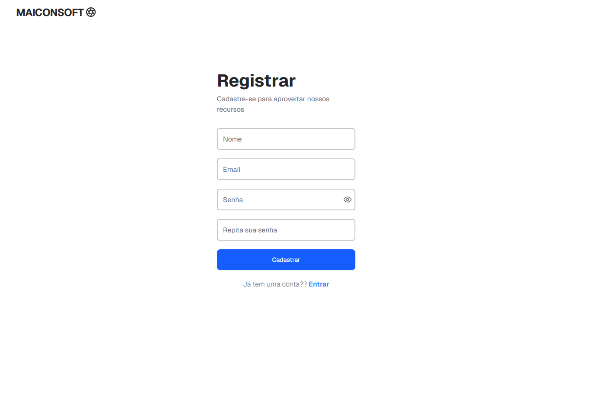

#### Pagina de registro com erro

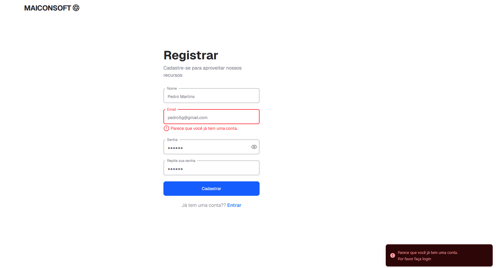

### Pagina de login

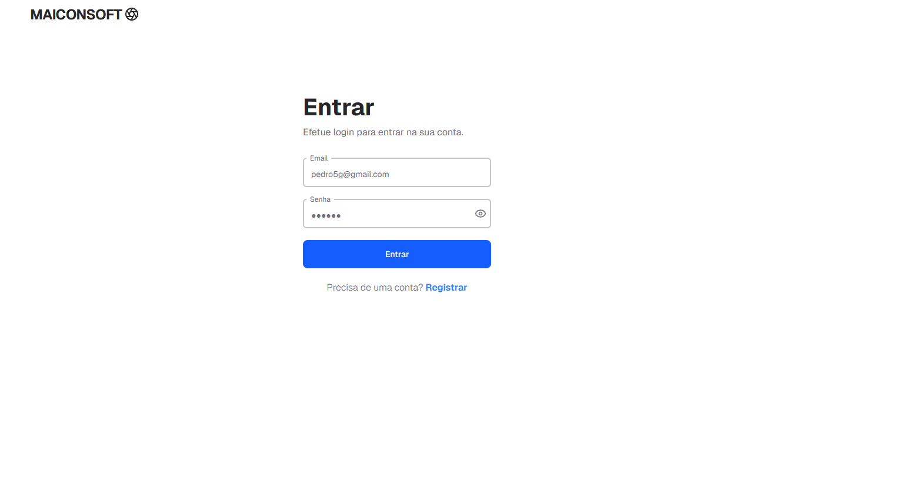

#### Pana de login com erro

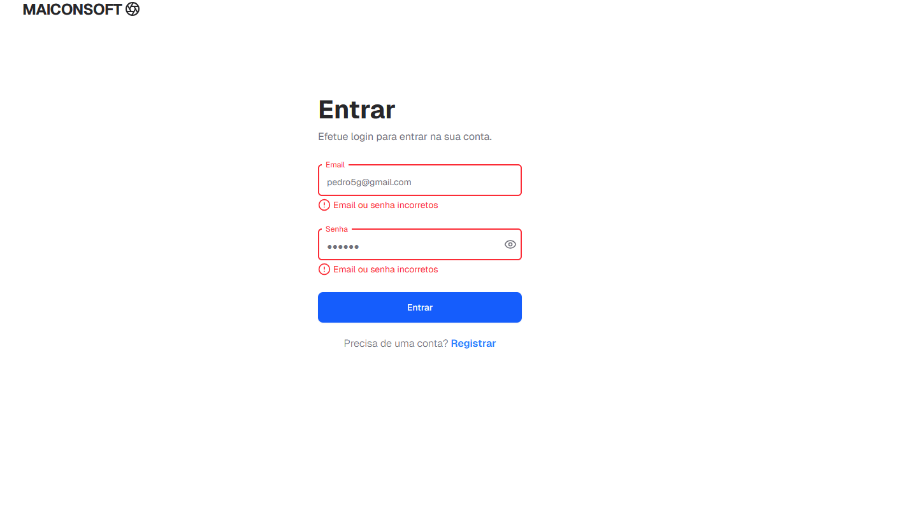

### Dashboard

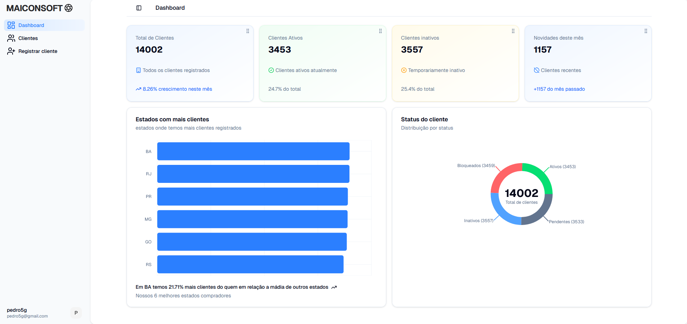

### Registro de clientes

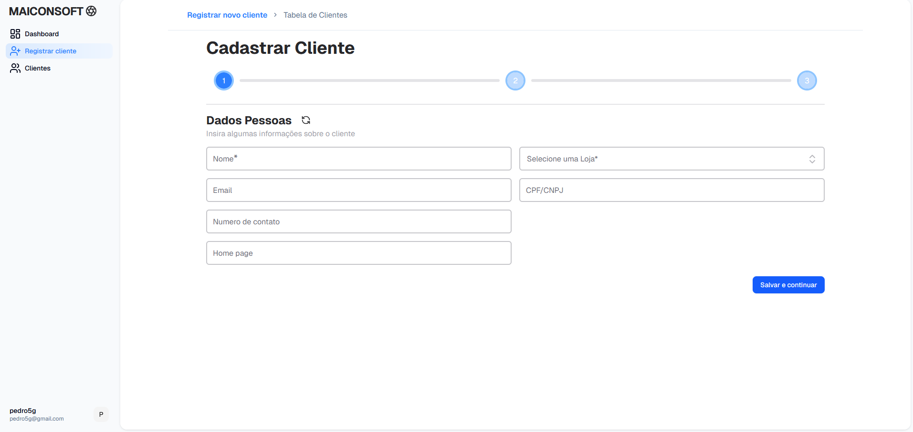

### Tabela de clientes

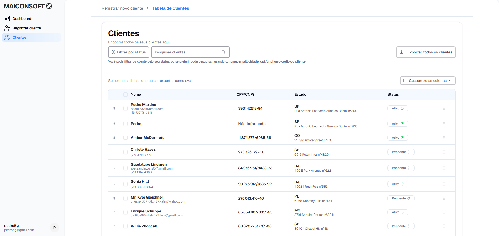

### Pagina do Cliente

#### Registrado com CPF

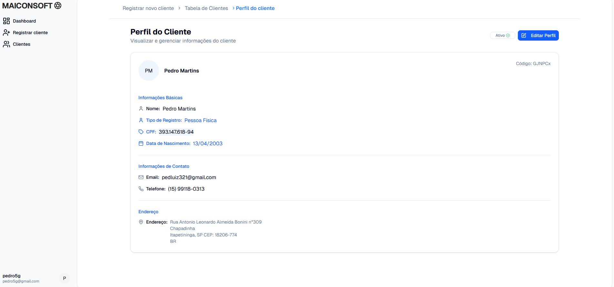

#### Registrado com CNPJ

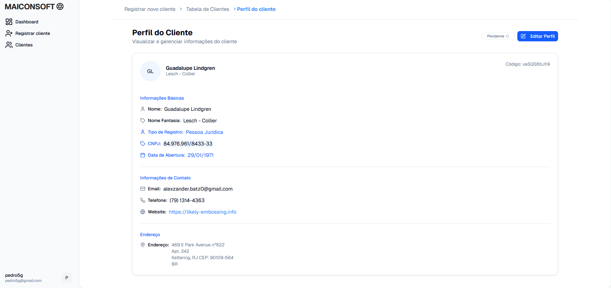

#### Varição de registro sem documentos e informações de contato

##### Pagina de Edição do cliente

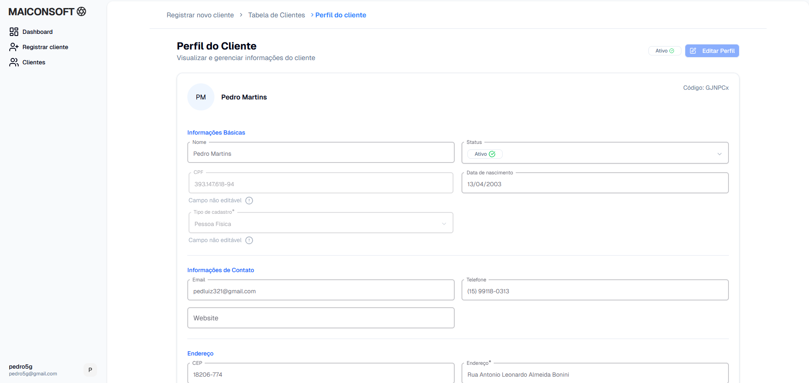

#### Pagina de Edição do cliente com algumas informações faltando

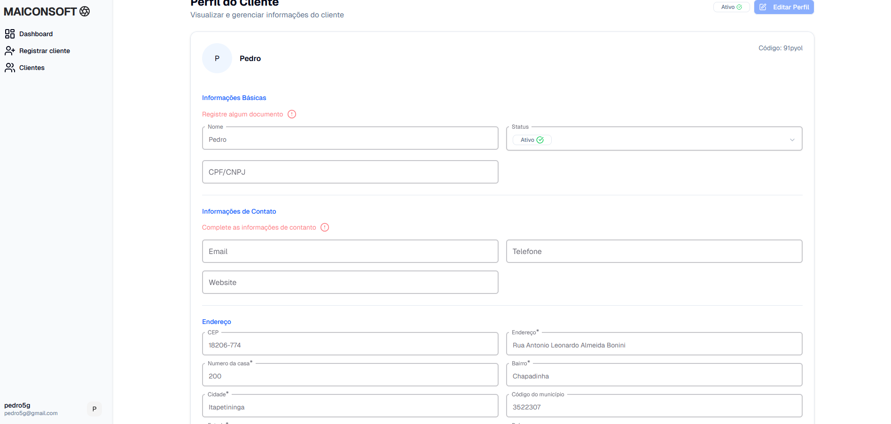

## Principais features

### Dashboard

#### Dashboard interativo e informativo, mostrando dados importante, como:

- Total de clientes
- Quantidade de clientes ativos
- Quantidade de clientes inativos
- Quantidade de clientes registrados no mês
- Gráfico mostrando os estados com a maior quantidade de clientes ativos
- Gráfico mostrando a quantidade de clientes por status, (ativo, inativo, pendente, bloqueado)

### Cadastro de Cliente

- Formulário de múltiplas etapas
- Campos customizados com mensagens de ajuda
- Campos dinâmicos, (cpf/cnpj), (cep) com autocomplete de dados
- Indicador de etapa
- Dados protegidos de recarregamento de pagina (evitando o incomodo de repetir preenchimento do formulário)
- Botão de limpar formulário
- Animações fluida entre cada etapa do formulário
- Validação de dados entre cada etapa do formulário (apenas ao clicar no botão salvar e continuar)

- Epata final sendo um overview de todos os dados, realizando uma ultima validação, garantindo a consistência dos dados
  e processando as repostas da api, como por exemplo, respostas de erro, onde o erro é reajustado ao campo correspondente;
- Todos os campos no overview não são editáveis, mas oferecem uma navegação rápida até o campo desejável, basta clicar no campo

]

- Apos o sucesso no cadastro do cliente, o formulário é reiniciado e os dados da tabela de clientes é atualizado

### Tabela de clientes

- Tabela completa com de dados do cliente
- Paginação e controle de quantidade de dados apresentados
- Customização de colunas
- Capacidade de reordenar as linhas
- Filtros por status
- Pesquisa inteligente (nome, cpf/cnpj, estado, email)
- Exportação de dados selecionados
- Capacidade de exportar e processar todos os clientes cadastrados com apenas um click
- Por meio de tabela, o usuário pode acessar a página do cliente, basta clicar no nome do cliente
  ou no pequeno menu, no final de cada linha
- Também é possível excluir o cliente acessando esse menu, onde ao clicar um alert pedindo a confirmação será mostrado

Importante notar que nas paginas de (Registrar novo cliente, Tabela de clientes e Perfil do cliente)
existe um breadcrumb que indica a pagina atual do usuário, esse componente permite a rápida navegação
entre as paginas;

### Perfil do cliente

- Pagina completa dedicada ao cliente
- Apresentando de maneira limpa e moderna todos os dados do cliente
- Alta adaptatividade do layout, com base nos dados do cliente, ex:.(ausência de documentos ou numero para contato)
- Botão para abrir o formulário de edição
- Animação moderna e suave entre a abertura e o fechamento do formulário de edição

# Coisitas mas

- Todas as paginas possem loaders de carregamento
- Animações fluidas e performáticas com CSS
- Todos o sistema possui um sistema robusto de cache garantindo,
  velocidade e evitando e excesso consultas na api
- Todas as operações que envolvem mutation, geram revalidações de cache
  garantido que o usuário sempre tenha a informação mais atualizada possível
